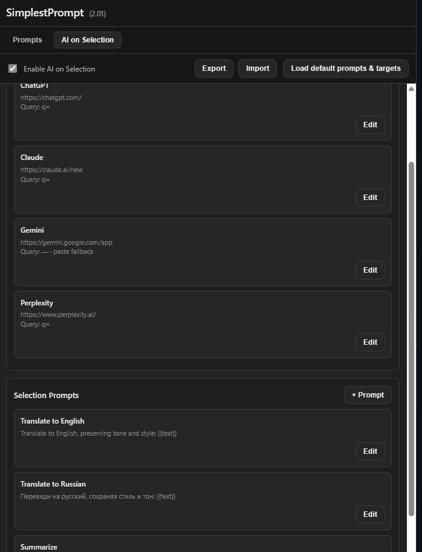
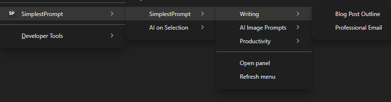
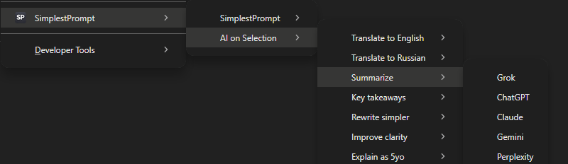

# SimplestPrompt

SimplestPrompt — lightweight Chrome Browser extension
Your Prompts + Instant AI on Selected Text
Stop copying & pasting the same prompts into ChatGPT, Claude, Grok, Gemini over and over.

Select any text on a page → right-click → Instant AI on Selection → pick a prompt template (e.g. “Translate”, “Explain like I’m 5”, “Rewrite better”, “Critique”, “Summarize”) → instantly opens your chosen AI with the text already inserted and your prompt ready
Works with ChatGPT, Grok, Claude, Gemini, Perplexity — and you can easily add any other AI you use
Classic mode still there: save your go-to prompts → they appear in the right-click menu → one click to copy or auto-paste anywhere
Everything stays 100% local in your browser — no account, no cloud, no tracking
Folders + drag-and-drop sorting
Export / import everything in one JSON file

Perfect for: quick translations, rewriting posts, summarizing articles, analyzing comments, improving your own text… all in one right-click.

## Preview









## Features

- Save prompts in folders.
- Reorder folders and prompts with drag-and-drop in the side panel.
- Open prompts from the browser context menu (`SimplestPrompt -> Folder -> Prompt`).
- Copy prompt text to clipboard.
- Optional auto-paste into focused input fields.
- **AI on Selection**:
  - Separate context menu (`AI on Selection`) appears only when text is selected.
  - Two-level menu: Selection Prompt -> AI Target.
  - Works with ChatGPT, Grok, Claude, Gemini, Perplexity, and custom targets.
  - Supports query parameter URLs or paste fallback.
- Side panel management UI:
  - Create folders and prompts.
  - Edit folders and prompts with double-click.
  - Delete folders and prompts from edit dialogs.
  - Import/export prompts as JSON.
  - AI on Selection tab with enable toggle, AI Targets, Selection Prompts, and import/export.
- Dynamic context menu rebuild after content updates.

## Tech Stack

- Manifest V3 extension
- Service worker background script (`background.js`)
- Side panel UI (`sidepanel.html`, `sidepanel.js`)
- Local persistence with `chrome.storage.local`
- Gemini content injection via content script (`content.js`)

## Download

You can download the latest version from the Releases page:

👉 https://github.com/thejohnd0e/SimplestPrompt/releases/latest

## Installation (Developer Mode)

1. Open `chrome://extensions`.
2. Enable **Developer mode**.
3. Click **Load unpacked**.
4. Select this project unpacked folder.

## Usage

1. Click the extension icon to open the side panel.
2. Add a folder and prompts.
3. Drag and drop cards to arrange order in the side panel (this order is used in the context menu).
4. Double-click a folder or prompt card to open edit mode.
5. On any regular website tab, right-click in a page or input field.
6. Choose `SimplestPrompt`, then a folder and prompt.
7. If auto-paste is enabled, the prompt is inserted into the target field; otherwise it is copied to the clipboard.
8. For AI on Selection: select text, right-click, choose `AI on Selection -> [Selection Prompt] -> [AI Target]`.

## Data Model

Stored in `chrome.storage.local`:

- `folders`: array of folder objects.
- `autoPaste`: boolean toggle for auto-insert behavior.
- `aiOnSelectionEnabled`: enable/disable AI on Selection menu.
- `aiTargets`: list of AI targets (name, base URL, query param, paste fallback).
- `selectionPrompts`: list of selection prompt templates using `{{text}}`.

Example folder item:

```json
{
  "id": "uuid",
  "name": "General",
  "prompts": [
    {
      "id": "uuid",
      "title": "Summarize",
      "text": "Summarize the following text...",
      "timestamp": "2026-02-16T00:00:00.000Z"
    }
  ]
}
```

Example AI target:

```json
{
  "id": "uuid",
  "name": "Gemini",
  "baseUrl": "https://gemini.google.com/app",
  "queryParam": "",
  "usePasteFallback": true
}
```

Example selection prompt:

```json
{
  "id": "uuid",
  "name": "Translate to Russian",
  "template": "Переведи на русский, сохраняя стиль и тон:\\n\\n{{text}}",
  "timestamp": "2026-02-16T00:00:00.000Z"
}
```

## Project Structure

- `manifest.json`: extension metadata, permissions, icons, entrypoints
- `background.js`: context menu, clipboard and auto-paste flow
- `sidepanel.html`: side panel layout and styles
- `sidepanel.js`: side panel state and interactions
- `content.js`: Gemini paste helper content script
- `icons/`: extension icons (16, 48, 128)

## Permissions

- `storage`: save folders/prompts locally
- `contextMenus`: create right-click entries
- `clipboardWrite`: copy prompt text
- `sidePanel`: show side panel UI
- `activeTab`: interact with current tab
- `scripting`: inject paste helper code into page context
- `host_permissions`: Gemini content script access

## Known Limitations

- Browser-internal pages like `chrome://*`, `about:*`, `edge://*` cannot be scripted by extensions.
- Some sites with restrictive CSP or custom editors may limit insertion behavior.

## License

MIT (recommended for open-source release).
