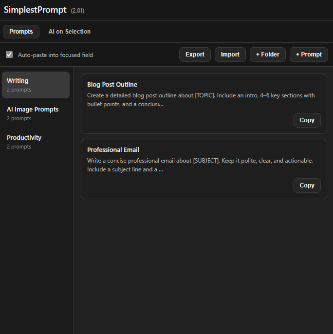

# SimplestPrompt

## Preview




SimplestPrompt is a lightweight Chrome Browser extension for storing reusable prompts and inserting them quickly from the right-click context menu.

No account or sign-in required. 

All yours prompts are stored locally in your browser - with optional export and import support.

## Features

- Save prompts in folders.
- Open prompts from the browser context menu (`SimplestPrompt -> Folder -> Prompt`).
- Copy prompt text to clipboard.
- Optional auto-paste into focused input fields.
- Side panel management UI:
  - Create folders
  - Rename folders
  - Create, edit, and delete prompts
  - Import/export prompts as JSON
- Dynamic context menu rebuild after content updates.

## Tech Stack

- Manifest V3 extension
- Service worker background script (`background.js`)
- Side panel UI (`sidepanel.html`, `sidepanel.js`)
- Local persistence with `chrome.storage.local`

## Download

You can download the latest version from the Releases page:

👉 https://github.com/thejohnd0e/SimplestPrompt/releases/latest


## Installation (Developer Mode)

1. Open `chrome://extensions`.
2. Enable **Developer mode**.
3. Click **Load unpacked**.
4. Select this project unpacked folder.

## Usage

1. Click the extension icon to open the side panel.
2. Add a folder and prompts.
3. On any regular website tab, right-click in a page or input field.
4. Choose `SimplestPrompt`, then a folder and prompt.
5. If auto-paste is enabled, the prompt is inserted into the target field; otherwise it is copied to the clipboard.

## Data Model

Stored in `chrome.storage.local`:

- `folders`: array of folder objects.
- `autoPaste`: boolean toggle for auto-insert behavior.

Example folder item:

```json
{
  "id": "uuid",
  "name": "General",
  "prompts": [
    {
      "id": "uuid",
      "title": "Summarize",
      "text": "Summarize the following text...",
      "timestamp": "2026-02-16T00:00:00.000Z"
    }
  ]
}
```

## Project Structure

- `manifest.json`: extension metadata, permissions, icons, entrypoints
- `background.js`: context menu, clipboard and auto-paste flow
- `sidepanel.html`: side panel layout and styles
- `sidepanel.js`: side panel state and interactions
- `icons/`: extension icons (16, 48, 128)

## Permissions

- `storage`: save folders/prompts locally
- `contextMenus`: create right-click entries
- `clipboardWrite`: copy prompt text
- `sidePanel`: show side panel UI
- `activeTab`: interact with current tab
- `scripting`: inject paste helper code into page context

## Known Limitations

- Browser-internal pages like `chrome://*`, `about:*`, `edge://*` cannot be scripted by extensions.
- Some sites with restrictive CSP or custom editors may limit insertion behavior.


## License

MIT (recommended for open-source release). Add a `LICENSE` file before publishing if needed.
